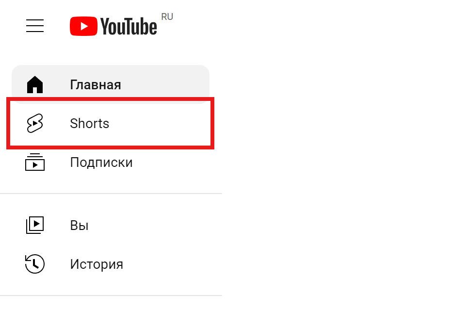
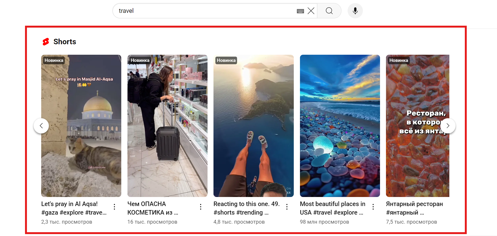
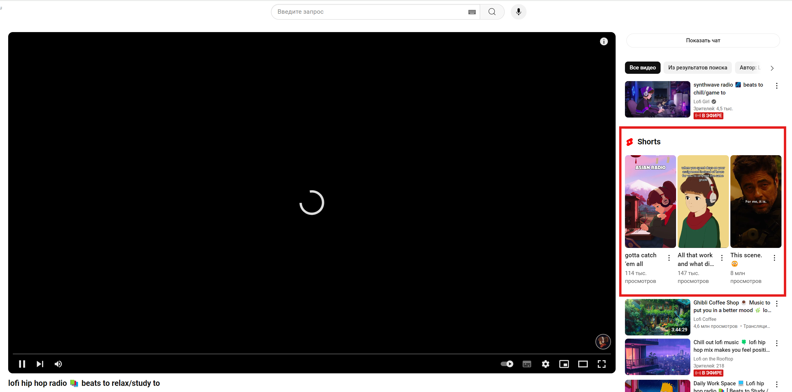

**ShortsBlock** a simple browser extension that allows you to hide short video Shorts on a YouTube page `https://www.youtube.com/`.

## Quick start

### Recommended installation method

> [!WARNING]
> If you use Tampermonkey 5.2.0+, don't forget to [enable «Developer Mode»](https://www.tampermonkey.net/faq.php#Q209)

1. Install the **[Tampermonkey](https://www.tampermonkey.net/index.php)** extension
2. Install the **[Script](https://update.greasyfork.org/scripts/547838/ShortsBlock.user.js)**

### Manual installation

1. Download the ZIP of this repository and unpack it locally

2. Open the extensions page, depending on the browser you are using:

- Google Chrome: `chrome://extensions/`
- Microsoft Edge: `edge://extensions/`
- Yandex Browser: `browser://extensions/`

and enable `Developer mode`

3. Specify the local path to the downloaded extension by selecting `Load unpacked`

## FAQ

  
Which blocks on the YouTube page will be hidden?

1. The Shorts section on the YouTube homepage

2. The Shorts section in the sidebar
   

3. The Shorts section in the search results
   

4. The Shorts section next to the video being played
   

